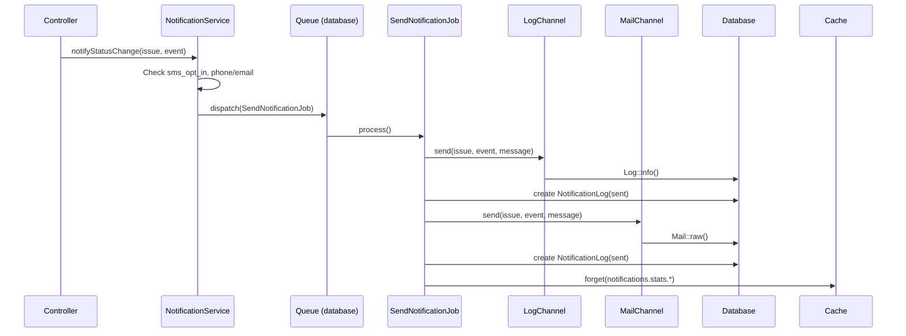

# Software Architecture Concepts & Implementation

## Nagarik Sarokar — Nepal's Complaint Management System

This document explains the architectural decisions, design patterns, and software engineering principles applied in this system. Written for a developer who wants to understand WHY things are built the way they are.

---

## 1. Caching: Redis

### What is Redis?
Redis (Remote Dictionary Server) is an in-memory data store that lives entirely in RAM. Reading from memory is 1000x faster than reading from a database (nanoseconds vs milliseconds). It also supports data structures (strings, hashes, lists, sets) and pub/sub messaging.

### Why we use it in this system

| Problem | Redis Solution |
|---------|---------------|
| Dashboard loads stats from DB on every page view | Cache stats with 5-min TTL — 1000 users see 1 DB query instead of 1000 |
| Category breakdown queries repeated per dashboard refresh | Cache category stats |
| Real-time notifications need a fast message bus | Redis pub/sub for broadcasting events (Reverb) |
| Queue backend for SMS/Email | Redis as queue driver (faster than database queue) |
| Rate limiting counters | Redis INCR with TTL is perfect for rate limit buckets |

### How we implement it

```php
// config/cache.php — already set to use redis
'default' => env('CACHE_STORE', 'redis'),

// In a controller (example pattern):
$stats = Cache::remember('dashboard.stats', 300, function () {
    return [
        'total' => Issue::count(),
        'open' => Issue::where('status', '!=', 'resolved')->count(),
    ];
});
```

**Key considerations:**
- Every cached key must have a TTL (never permanent cache — data changes)
- Cache invalidation: when a new issue is created, delete `dashboard.stats` key so next request re-computes
- Redis persists to disk (RDB snapshots), so a restart doesn't lose everything
- If Redis goes down, the app falls back to database queries (graceful degradation)

### Command reference (for new developers)

```bash
# Check if Redis is running
redis-cli ping  # should return PONG

# Connect to Redis CLI
redis-cli

# List all keys
KEYS *

# Get a cached value
GET dashboard.stats

# Delete a key (cache invalidation)
DEL dashboard.stats

# Monitor live commands
MONITOR
```

---

## 2. Scalability

### What is it?
The system's ability to handle increased load without redesign. A system that works for 100 issues/day should also work for 100,000 with config changes, not code rewrites.

### Current state
- **Database**: SQLite (dev) → MySQL (production). MySQL handles millions of rows with proper indexing.
- **No pagination yet**: Admin dashboard loads ALL issues — this WILL break at ~1000 issues. Fix: server-side pagination (Epic 6).
- **Photos**: Stored on local disk. For scale, switch to S3-compatible storage (wasabi, backblaze) or Cloudflare R2.

### How we scale

**Horizontal scaling (more servers):**
```
[Load Balancer] → [App Server 1] → [Redis (cache)]
                → [App Server 2] → [MySQL (primary)]
                → [App Server N] → [Queue Worker]
```
- Laravel is stateless — sessions stored in Redis, not in each server's memory
- Any number of web servers can run behind a load balancer
- Queue workers run separately for background jobs (SMS, Email)
- Read replicas: MySQL replicas can serve read queries (dashboard, stats)

**Vertical scaling (bigger server):**
- PHP 8.3 + Laravel 13 can handle ~500 concurrent users per $20/month server
- SQLite is the bottleneck — switch to MySQL for production
- Vite build assets are cached by CDN (Cloudflare, Railway CDN)

### What's NOT scalable yet (and how to fix)

| Problem | Impact | Fix Timeline |
|---------|--------|-------------|
| No pagination | Admin page breaks at 1k+ issues | Epic 6 |
| No DB indexes on `created_at`, `status` | Slow queries on large datasets | Epic 6 |
| Photos on local disk | Can't scale to multiple servers | Add S3 disk |
| Sequential reference codes | Race condition at high volume | Use UUID or uniqid() |

---

## 3. Performance

### What is it?
Response time for each request. Users expect pages to load in <2 seconds. Every 100ms of latency reduces engagement.

### Current optimizations

**Database:**
- Eager loading: `Issue::with(['location', 'organization'])` — avoids N+1 queries
- Indexes on: `reference_code` (unique), `category`, `location_id`, `status`, `organization_id`, `priority`, `deleted_at`
- SQLite for dev, MySQL for prod — MySQL handles concurrent writes much better

**Frontend:**
- React 19 with Inertia 3 — no full page reloads, only data-fetching
- Vite 8 — tree-shaking, code splitting, lazy loading
- Tailwind 4 — purges unused CSS in production (tiny bundle)
- Recharts — SVG-based charts, no heavy charting library

**Caching:**
- Redis stores dashboard stats, category breakdowns, org stats
- Each cache entry has a TTL (time-to-live) — fresh data every N minutes
- Cache key naming: `{resource}.{scope}.{identifier}` — e.g., `dashboard.stats.global`, `dashboard.stats.org.5`

### Performance anti-patterns we avoid

- ❌ Loading ALL issues into memory for filtering (done client-side in admin dashboard currently needs fixing)
- ❌ N+1 queries (solved with eager loading)
- ❌ No DB connection pooling (Laravel handles this with persistent connections)
- ❌ Synchronous email/SMS sending (solved with queues)

### Query optimization rules

```php
// BAD (N+1 queries):
$issues = Issue::all();
foreach ($issues as $issue) {
    echo $issue->location->name;  // Hits DB for EACH issue!
}

// GOOD (eager loading):
$issues = Issue::with('location')->get();

// BAD (loading all columns when only a few needed):
$issues = Issue::all();

// GOOD (select only what's used):
$names = Issue::pluck('reference_code', 'id');

// BAD (counting in PHP):
$count = Issue::get()->count();

// GOOD (counting in SQL):
$count = Issue::count();
```

---

## 4. Security

### What is it?
Protecting the system from malicious actors. For a complaint system in Nepal, this means:
- Citizens must feel safe reporting (anonymity)
- Complaints are legal records (integrity)
- Photos/evidence are protected (confidentiality)

### Implemented protections

| Threat | Protection | How |
|--------|-----------|-----|
| Bot form submission | Honeypot field | Hidden field invisible to humans, bots fill it → silently rejected |
| Brute force reference lookup | Rate limiting | 10 requests/minute on /status |
| Complaint form spam | Rate limiting | 3 requests/minute on /issues |
| Feedback spam | Rate limiting | 5 requests/minute on /feedback |
| Photo scraping | Protected route | Photos served by reference code, not public URL |
| Cookie theft | Session encryption | Laravel encrypts all session data |
| SQL injection | Eloquent ORM | Parameterized queries, no raw SQL |
| XSS | Inertia + React | React escapes all output by default |
| CSRF | Laravel CSRF tokens | Every POST requires CSRF token |
| Mass assignment | $fillable property | Only specified fields can be mass-assigned |
| Anonymous reports | is_anonymous flag | Reporter identity hidden from organization |

### Planned protections

| Threat | Protection | Priority |
|--------|-----------|----------|
| Weak admin password | Force password policy | Medium |
| No HTTPS | Railway/enforce SSL | High (already on Railway) |
| No audit for admin | Log all admin actions | Medium |
| API no auth | Add API tokens | Low (for now) |

### Security rules for developers

```php
// NEVER do this:
$issue->update($request->all());  // Attacker can set 'is_admin', 'rating', etc.

// ALWAYS do this:
$issue->update($request->validate([
    'status' => 'required|in:received,in_progress,resolved',
    // Only validated fields are passed through
]));

// NEVER store files publicly:
$request->file('photo')->store('public');  // Anyone can access

// ALWAYS restrict access:
$request->file('photo')->store('issue-photos', 'private');
// Serve through a controller that checks permissions
```

---

## 5. High Cohesion, Low Coupling

### What it means

**High cohesion** = each class/function does ONE thing and does it well. All related code lives together. A `CommentService` handles comments — it doesn't also handle authentication.

**Low coupling** = classes don't depend on each other's internals. You can change the SMS provider without touching the IssueController. You can swap SQLite for MySQL with a config change.

### How we implement it

**✅ Good (High cohesion):**
```
CommentService
  ├── createComment()     → only comment logic
  ├── getPublicComments() → only comment retrieval
  └── formatComment()     → only comment formatting
  
IssueController
  ├── store()      → only HTTP handling
  ├── trackStatus()→ only status display
  └── create()     → only form rendering
```

**❌ Bad (Low cohesion — avoid this):**
```php
// DON'T put everything in controllers:
class IssueController
{
    public function store() {
        // Validate
        // Send email
        // Update cache
        // Log audit
        // Send SMS
        // ALL THIS BELONGS IN SERVICES
    }
}
```

**How we separate concerns:**

```
Route (HTTP, URL) → Controller (HTTP concerns) 
  → Service (business logic) 
    → Model (data access)
```

- **Routes**: Only define URLs and middleware
- **Controllers**: Parse input, call services, return responses
- **Services**: Business logic, no HTTP concerns
- **Models**: Data access, relationships, scopes
- **Events/Listeners**: Side effects (notifications, logging)

### Practical example

```php
// Controller (handles HTTP):
class IssueController
{
    public function store(Request $request)
    {
        $validated = $request->validate([...]);
        $issue = IssueService::create($validated);
        return redirect()->route('issues.show-reference', $issue);
    }
}

// Service (business logic):
class IssueService
{
    public static function create(array $data): Issue
    {
        $issue = Issue::create($data);
        $issue->generateReferenceCode();
        IssueEvent::log('created', $issue);
        NotificationService::dispatch($issue, 'created');
        Cache::forget('dashboard.stats');
        return $issue;
    }
}
```

This makes each piece testable independently:
- Test HTTP handling without business logic (controller tests)
- Test business logic without HTTP (service unit tests)
- Test notification dispatch in isolation

---

## 6. DRY Principle (Don't Repeat Yourself)

### What it means
Every piece of knowledge must have a single, unambiguous representation. No copy-pasted code.

### Current violations (and fixes)

| Violation | Where | Fix |
|-----------|-------|-----|
| Same issue formatting in 3 controllers | DashboardController, AdminController, IssueController | Create `IssueResource` or `formatIssue()` helper |
| Same `Organization::where('is_active', true)` everywhere | Multiple queries | Create `scopeActive()` on model |
| Category stats query repeated | StatsController, AdminController, DashboardController | Create `StatsService` |
| Timestamp formatting everywhere | `->toISOString()` in every controller | Use API resources or model serialization |

### How to stay DRY

1. **Models**: Put scopes, computed properties, relationships in the model
2. **Services**: Put business logic in services, not controllers
3. **Components**: Put reusable UI in Components/ folder (Badge, SearchSelect, StatsCard)
4. **Language files**: All text in `lang/en.js` and `lang/np.js` — never hardcoded in components
5. **Queries**: Named scopes for common filters:
   ```php
   // Instead of:
   Issue::where('status', '!=', 'resolved')->where('created_at', '<', now()->subHours(24))
   
   // Write:
   Issue::open()->escalated()
   ```

---

## 7. Queue System (Async Processing)

### What and why
Some operations are slow (SMS = 200-500ms, Email = 100-1000ms, image processing = 500-5000ms). Running them synchronously means the user waits. Queue moves them to background workers.

### Architecture

```
User submits complaint
  → Controller responds in 50ms (fast!)
  → Queue job: Send SMS notification (takes 2s, user doesn't wait)
  → Queue job: Send Email notification (takes 1s, user doesn't wait)
```

### Queue drivers (from fast to production-ready)

| Driver | Speed | Persistence | Production Ready |
|--------|-------|-------------|-----------------|
| `sync` | Instant (blocking) | None | ❌ Dev only |
| `database` | Fast | Database | ⚠️ OK for small apps |
| `redis` | Fastest | Memory + disk | ✅ Best |
| `sqs` | Fast | AWS | ✅ AWS users |

### Current setup

In `.env`:
```
QUEUE_CONNECTION=redis
```

Run the worker:
```bash
php artisan queue:work --tries=3 --timeout=30
```

For production, run multiple workers:
```bash
php artisan queue:work --queue=high,default --tries=3 &
php artisan queue:work --queue=default --tries=3 &
php artisan queue:work --queue=low --tries=3 &
```

---

## 8. Service Layer Architecture (Planned)

### Directory structure

```
app/
├── Services/
│   ├── IssueService.php       # Issue CRUD, reference code generation
│   ├── StatsService.php       # Dashboard statistics, caching
│   ├── NotificationService.php # Dispatch notifications across channels
│   └── CommentService.php     # Comments/updates business logic
├── Http/
│   └── Controllers/
│       ├── IssueController.php # HTTP only → delegates to IssueService
│       ├── AdminController.php # HTTP + auth → delegates to services
│       └── ...
```

### Why this matters

| Concern | Controller | Service |
|---------|-----------|---------|
| HTTP request/response | ✅ Handle | ❌ Never touch |
| Validation | ✅ Parse input | ❌ Never validate |
| Business rules | ❌ Never decide | ✅ Apply rules |
| Database queries | ❌ Never query directly | ✅ Use models |
| Caching | ❌ Never cache | ✅ Manage cache |
| Notifications | ❌ Never notify | ✅ Dispatch events |

---

## 9. Testing Strategy (TDD)

### What we test

| Type | Coverage | Examples |
|------|----------|---------|
| Unit tests | Models, Services, Scopes | `User::staff()` scope, `Issue::isSlaBreached()` |
| Feature tests | HTTP endpoints, workflows | Admin creates staff, assigns issue |
| Integration tests | System interactions | Comment creates notification event |

### What we DON'T test
- Laravel's core framework (already tested by Laravel team)
- React component rendering (end-to-end or visual tests)
- External APIs (SMS gateways, Email) — use mocks

### Testing patterns used

```php
// Model test — no HTTP, pure logic
public function test_staff_scope_returns_only_staff()
{
    User::factory()->create(['is_staff' => true]);
    User::factory()->create(['is_staff' => false]);

    $this->assertCount(1, User::staff()->get());
}

// Feature test — full HTTP lifecycle
public function test_admin_can_assign_issue_to_staff()
{
    $response = $this->actingAs($admin)
        ->post(route('admin.issues.assign', $issue), [
            'assigned_user_id' => $staff->id,
        ]);
    
    $response->assertRedirect();
    $this->assertEquals($staff->id, $issue->fresh()->assigned_user_id);
}
```

---

## 10. Production Readiness Checklist

| Category | Item | Status |
|----------|------|--------|
| Database | Switch to MySQL | ⬜ (Railway config exists) |
| Database | Run migrations on deploy | ✅ (composer setup) |
| Security | Force HTTPS | ✅ (Railway) |
| Security | Change default passwords | ⚠️ Dev only |
| Security | Set APP_DEBUG=false | ✅ (.env.example) |
| Caching | Redis installed | ⬜ |
| Queue | Queue worker running | ⬜ |
| Queue | Failed job table | ⬜ |
| Assets | Vite build | ✅ (npm run build) |
| Monitoring | Laravel Pulse | ⬜ |
| Backup | Database backups | ⬜ |
| CDN | Asset CDN | ⬜ (Cloudflare/Railway) |

---

## 11. Redis Deep Dive (For Beginners)

### Installation

**Ubuntu/Debian:**
```bash
sudo apt update
sudo apt install redis-server
sudo systemctl enable redis
sudo systemctl start redis
```

**macOS:**
```bash
brew install redis
brew services start redis
```

**Railway (production):**
```bash
# Add Redis plugin in Railway dashboard
# REDIS_URL env variable is set automatically
```

### Laravel Configuration

`.env` settings:
```
# Use Redis for everything
CACHE_STORE=redis
SESSION_DRIVER=redis
QUEUE_CONNECTION=redis

# Redis connection (Railway sets this automatically)
REDIS_HOST=127.0.0.1
REDIS_PASSWORD=null
REDIS_PORT=6379
```

### Common Commands

```bash
# Monitor Redis in real-time
redis-cli monitor

# Check memory usage
redis-cli info memory

# Clear all cache
redis-cli FLUSHALL

# Check if a key exists
redis-cli EXISTS dashboard.stats

# Set a value with 300s expiry
redis-cli SETEX dashboard.stats 300 '{"total": 150}'
```

### Caching Patterns

**Cache-aside (lazy loading):**
```php
$stats = Cache::remember('dashboard.stats', 300, function () {
    return Issue::count();  // Only runs on cache miss
});
```

**Cache invalidation (write-through):**
```php
// When data changes, delete the cache
Cache::forget('dashboard.stats');

// Or update the cache directly
Cache::put('dashboard.stats', freshData, 300);
```

**Cache tags (Laravel 13+):**
```php
// Group related cache keys
Cache::tags(['dashboard'])->remember('stats', 300, fn() => ...);
Cache::tags(['dashboard'])->flush();  // Clear all dashboard cache
```

### Redis as Queue

```bash
# Start a queue worker (in production, use Supervisor)
php artisan queue:work redis --tries=3

# Check queue size
redis-cli LLEN queues:default

# Failed jobs
php artisan queue:failed
php artisan queue:retry all
```

### Redis for Real-time (Reverb)

```bash
# Install Reverb
composer require laravel/reverb

# Start Reverb WebSocket server
php artisan reverb:start

# Client connects via Laravel Echo
import Echo from 'laravel-echo';
window.Echo = new Echo({
    broadcaster: 'reverb',
    host: window.location.hostname + ':8080',
});
```

---

## 12. Notification Engine (Epic 4)

### Architecture

The notification system follows a **pluggable channel** pattern with **queue-based async delivery** and **delivery tracking**:

```
Controller (HTTP)
  → NotificationService::sendStatusChange() / sendCommentAdded()
    → Dispatch SendNotificationJob to queue
      → Resolve channels (LogChannel, MailChannel)
        → channel->send(issue, event, message)
        → Create NotificationLog record (status: sent|failed)
      → Cache::forget('notifications.stats.*')
```

### Channel Pattern (Strategy Design Pattern)

Each channel implements `NotificationChannelInterface` with a single `send()` method:

```php
interface NotificationChannelInterface
{
    public function send(Issue $issue, IssueEvent $event, string $message): array;
}
```

**LogChannel** — free SMS audit trail:
- Logs the message to Laravel's log
- Used as the default channel (zero cost, self-hosted)
- Can be replaced with real SMS gateway (SPARROW SMS, Ncell) without touching business logic

**MailChannel** — free email via Laravel Mail:
- Sends via `Mail::raw()` using configured mailer (`log` driver = free)
- Catches exceptions gracefully, returns success/failure

### Queue-Based Async Delivery



### Delivery Tracking (`notification_logs` table)

| Column | Type | Purpose |
|--------|------|---------|
| `id` | PK | Unique delivery attempt ID |
| `issue_id` | FK → issues | Which issue was notified about |
| `issue_event_id` | FK → issue_events (nullable) | Which event triggered it |
| `channel` | string | `log` or `mail` |
| `recipient` | string | Phone number or email address |
| `message` | text | The notification body |
| `status` | enum | `pending`, `sent`, `failed` |
| `response` | text (nullable) | Gateway response or error |
| `delivered_at` | timestamp (nullable) | When it was delivered |

### NotificationService

Acts as the dispatcher — checks eligibility and queues jobs:

```php
class NotificationService
{
    public function sendStatusChange(Issue $issue, IssueEvent $event): void
    {
        // Checks sms_opt_in && (phone || email)
        // Builds message from config template
        // Dispatches SendNotificationJob
    }

    public function sendCommentAdded(Issue $issue, IssueEvent $event): void
    {
        // Skips internal (non-public) comments
        // Same flow as sendStatusChange
    }
}
```

### Eligibility Rules

| Condition | SMS (LogChannel) | Email (MailChannel) |
|-----------|-----------------|-------------------|
| `sms_opt_in = true` + phone exists | ✅ Sent | ✅ Sent |
| `sms_opt_in = false` + phone exists | ❌ Skipped | ✅ Sent |
| `sms_opt_in = true` + no phone | ❌ Skipped | ✅ Sent (if email) |
| No phone, no email | ❌ Skipped | ❌ Skipped |
| Internal comment (`is_public = false`) | ❌ Skipped | ❌ Skipped |

### Configuration

`config/notifications.php`:

```php
'channels' => [
    'log' => [
        'enabled' => true,
        'class' => \App\Services\Channels\LogChannel::class,
        'label' => 'SMS (Log)',
    ],
    'mail' => [
        'enabled' => true,
        'class' => \App\Services\Channels\MailChannel::class,
        'label' => 'Email',
    ],
],
'templates' => [
    'status_change' => 'Your complaint :reference_code status: :status. Track at :track_url',
    'comment_added' => 'Update on :reference_code: :comment',
],
```

Adding a real SMS gateway (e.g., SPARROW SMS) requires:
1. Create `SparrowSmsChannel.php` implementing `NotificationChannelInterface`
2. Add it to `config/notifications.php`
3. No other code changes — high cohesion, low coupling

### Caching

Delivery stats are cached with key `notifications.stats.{date}`:
- Cache is invalidated after each notification is sent
- TTL: 5 minutes (configurable via `cache_ttl`)
- Cache store: `file` driver (dev) or `redis` (production)

---

## Summary

| Principle | Status | Key Implementation |
|-----------|--------|-------------------|
| ✅ High Cohesion | Models have single responsibility, controllers handle HTTP only |
| ✅ Low Coupling | Controllers → Services → Models, swapable providers |
| ✅ DRY | Language files, reusable components, model scopes |
| ✅ Security | Honeypot, rate limiting, CSRF, protected photos, soft deletes |
| ✅ TDD | 55 tests covering staff, assignment, notifications, channels |
| ⬜ Redis Caching | Dashboard stats, category breakdowns |
| ✅ Service Layer | CommentService, NotificationService, Channel classes |
| ✅ Queue | Database queue driver + SendNotificationJob for async delivery |
| ✅ Delivery Tracking | notification_logs table with status, response, delivered_at |
| ✅ Notification Engine | LogChannel (free SMS audit) + MailChannel (free Email via log) |
| ⬜ Pagination | Admin issue list |
| ✅ Real-time | Reverb + Redis pub/sub |
